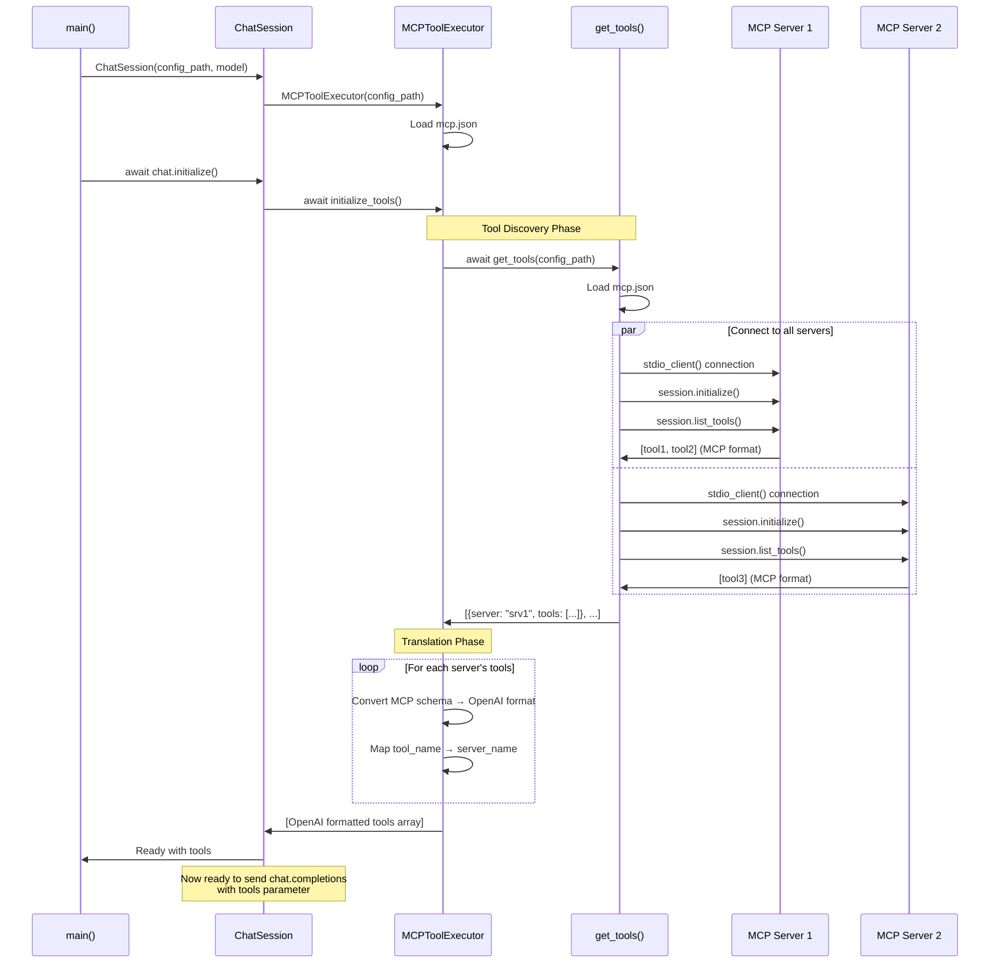

### Initialization Sequence

This diagram shows how MCP tools are discovered and formatted for OpenAI during startup:

```mermaid
sequenceDiagram
    participant Main as main()
    participant Chat as ChatSession
    participant Executor as MCPToolExecutor
    participant GetTools as get_tools()
    participant MCP1 as MCP Server 1
    participant MCP2 as MCP Server 2

    Main->>Chat: ChatSession(config_path, model)
    Chat->>Executor: MCPToolExecutor(config_path)
    Executor->>Executor: Load mcp.json

    Main->>Chat: await chat.initialize()
    Chat->>Executor: await initialize_tools()

    Note over Executor,GetTools: Tool Discovery Phase
    Executor->>GetTools: await get_tools(config_path)
    GetTools->>GetTools: Load mcp.json

    par Connect to all servers
        GetTools->>MCP1: stdio_client() connection
        GetTools->>MCP1: session.initialize()
        GetTools->>MCP1: session.list_tools()
        MCP1->>GetTools: [tool1, tool2] (MCP format)
    and
        GetTools->>MCP2: stdio_client() connection
        GetTools->>MCP2: session.initialize()
        GetTools->>MCP2: session.list_tools()
        MCP2->>GetTools: [tool3] (MCP format)
    end

    GetTools->>Executor: [{server: "srv1", tools: [...]}, ...]

    Note over Executor: Translation Phase
    loop For each server's tools
        Executor->>Executor: Convert MCP schema → OpenAI format
        Executor->>Executor: Map tool_name → server_name
    end

    Executor->>Chat: [OpenAI formatted tools array]
    Chat->>Main: Ready with tools

    Note over Chat: Now ready to send chat.completions<br/>with tools parameter
```
