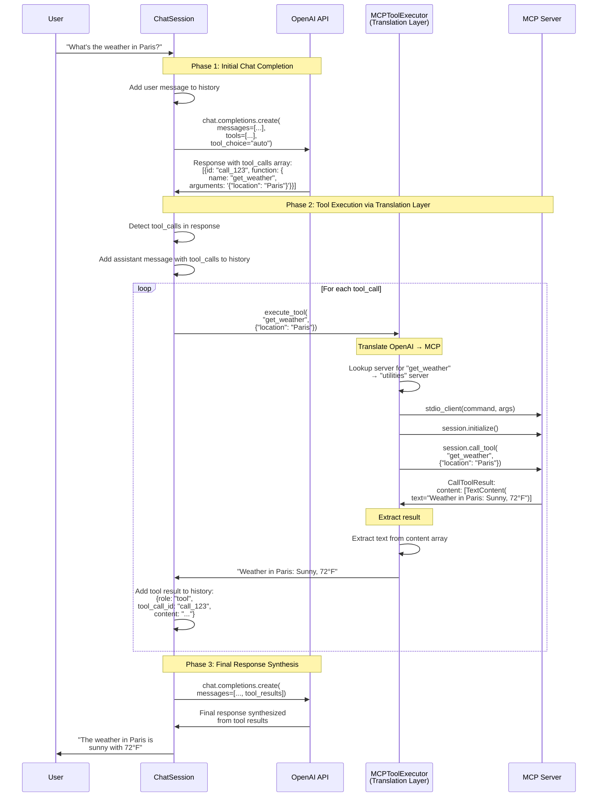

## MCP Tool Calls

```mermaid
sequenceDiagram
    participant User
    participant Chat as ChatSession
    participant OpenAI as OpenAI API
    participant Executor as MCPToolExecutor<br/>(Translation Layer)
    participant MCP as MCP Server

    User->>Chat: "What's the weather in Paris?"

    Note over Chat,OpenAI: Phase 1: Initial Chat Completion
    Chat->>Chat: Add user message to history
    Chat->>OpenAI: chat.completions.create(<br/>messages=[...],<br/>tools=[...],<br/>tool_choice="auto")
    OpenAI->>Chat: Response with tool_calls array:<br/>[{id: "call_123", function: {<br/>name: "get_weather",<br/>arguments: '{"location": "Paris"}'}}]

    Note over Chat,MCP: Phase 2: Tool Execution via Translation Layer
    Chat->>Chat: Detect tool_calls in response
    Chat->>Chat: Add assistant message with tool_calls to history

    loop For each tool_call
        Chat->>Executor: execute_tool(<br/>"get_weather",<br/>{"location": "Paris"})

        Note over Executor: Translate OpenAI → MCP
        Executor->>Executor: Lookup server for "get_weather"<br/>→ "utilities" server
        Executor->>MCP: stdio_client(command, args)
        Executor->>MCP: session.initialize()
        Executor->>MCP: session.call_tool(<br/>"get_weather",<br/>{"location": "Paris"})
        MCP->>Executor: CallToolResult:<br/>content: [TextContent(<br/>text="Weather in Paris: Sunny, 72°F")]

        Note over Executor: Extract result
        Executor->>Executor: Extract text from content array
        Executor->>Chat: "Weather in Paris: Sunny, 72°F"

        Chat->>Chat: Add tool result to history:<br/>{role: "tool",<br/>tool_call_id: "call_123",<br/>content: "..."}
    end

    Note over Chat,OpenAI: Phase 3: Final Response Synthesis
    Chat->>OpenAI: chat.completions.create(<br/>messages=[..., tool_results])
    OpenAI->>Chat: Final response synthesized<br/>from tool results
    Chat->>User: "The weather in Paris is<br/>sunny with 72°F"
```
